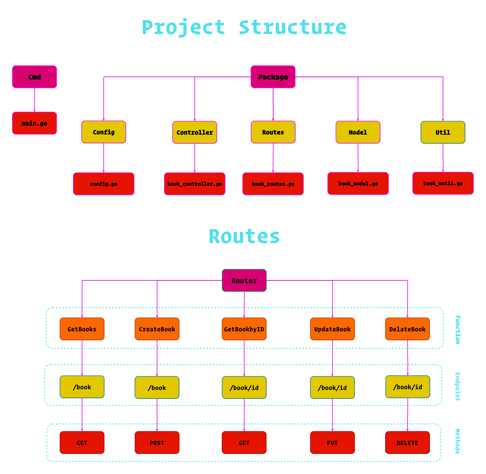

# Structure Project



---

# Running

`./bookstore`

---

# Package

- `github.com/gorilla/mux`
- `github.com/jinzhu/gorm`
- `github.com/jinzhu/gorm/dialects/mysql`

---

# MySql Database

- `CREATE DATABASE bookstore`

---

# Postman

- **CREATE**

```http
POST http://localhost:5000/book/
Content-Type : application/json

{
    "author": "Chinua Achebe",
    "country": "Nigeria",
    "imageLink": "images/things-fall-apart.jpg",
    "language": "English",
    "link": "https://en.wikipedia.org/wiki/Things_Fall_Apart\n",
    "pages": 209,
    "title": "Things Fall Apart",
    "year": 1958
}
```

- **GET ALL BOOK**

```http
GET http://localhost:5000/book/
```

- **GET BOOK By ID**

```http
GET http://localhost:5000/book/
```

- **DELETE BOOK**

```http
DELETE http://localhost:5000/book/1
```

- **UPDATE BOOK**

```http
PUT http://localhost:5000/book/1
Content-Type : application/json

{
    "author": "Michel Paijo",
    "country": "Nigeria",
    "imageLink": "images/things-fall-apart.jpg",
    "language": "English",
    "link": "https://en.wikipedia.org/wiki/Things_Fall_Apart\n",
    "pages": 209,
    "title": "Things Fall Apart",
    "year": 1958
}
```
